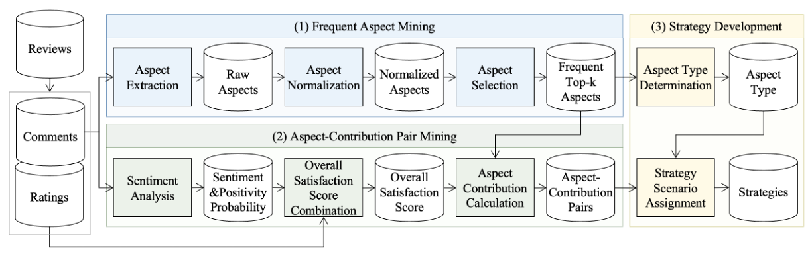

# An omnichannel strategy development framework leveraging customer opinion divergence via large language models and explainable AI
This is the official repository of "An omnichannel strategy development framework leveraging customer opinion divergence via large language models and explainable AI".

## Framework


## Set up
Please follow the steps below to perform the installation:

**1. Create virtual environment**
```bash
conda create -n omnichannel python=3.9
conda activate omnichannel
```

**2. Install packages**
```bash
pip install -r requirements.txt
```

**3. Configure API key**

Create a `.env` file in the `omnichannel/` directory:
```
OPENAI_API_KEY=your_openai_api_key_here
```
> **Note:** An OpenAI API key is required for aspect normalization (Step 2) and aspect type determination (Step 8). You can obtain one at [platform.openai.com](https://platform.openai.com).

**4. Download model weights**

Download the following files from [imlab-ewha/KcELECTRA-base-v2022-Aspect-Extraction](https://huggingface.co/imlab-ewha/KcELECTRA-base-v2022-Aspect-Extraction) and place them in `checkpoints/kc_electra/`:

| File | Required for |
|---|---|
| `aspect_extraction_model.pt` | Inference (Steps 1–9) |
| `pytorch_model.bin` | Fine-tuning (`main_fine-tuning.py --model kc_electra`) |

## Quick Start

**Inference** — runs all 9 steps end-to-end:
```bash
cd omnichannel/
python main_inference.py [--input PATH] [--output-dir DIR]
```
- Intermediate outputs saved under `outputs/`; final output: `outputs/scenario_assignment/scenario_assignment.csv`.
- Sample data: `data/example_review.csv`.

**Fine-tuning** — trains KcELECTRA and/or GRU from your own labeled data:
```bash
python main_fine-tuning.py --model all         # trains both models
python main_fine-tuning.py --model kc_electra
python main_fine-tuning.py --model gru
```
- Sample data: `data/kc_electra_train_example.json`, `data/gru_example.txt`.
- Trained weights saved to `checkpoints/` with timestamp suffix.

## Scripts

### Step 1 — Aspect Extraction
- `src/aspect_extraction.py`
- Extracts aspects from Korean reviews using a fine-tuned KcELECTRA model.

| Argument | Default | Description |
|---|---|---|
| `--input` | `data/example_review.csv` | Input review CSV |
| `--output` | `outputs/aspect_extraction/` | Output directory |
| `--batch-size` | `50` | Inference batch size |


### Step 2 — Aspect Normalization
- `src/aspect_normalization.py`
- Normalizes raw aspect expressions into standardized forms via the OpenAI Chat API.

| Argument | Default | Description |
|---|---|---|
| `--input` | `outputs/aspect_extraction/aspect_extraction.csv` | Input CSV |
| `--output-dir` | `outputs/aspect_normalization/` | Output directory |
| `--model` | `gpt-4o-mini` | OpenAI model |
| `--temperature` | `0.0` | Sampling temperature |
| `--seed` | `42` | Random seed |


### Step 3 — Aspect Selection
- `src/aspect_selection.py`
- Selects the top-k most frequent normalized aspects.

| Argument | Default | Description |
|---|---|---|
| `--input` | `outputs/aspect_normalization/` | Normalization output dir (picks latest CSV) |
| `--output-dir` | `outputs/aspect_selection/` | Output directory |
| `--top-k` | `10` | Number of aspects to select |


### Step 4 — Sentiment Analysis
- `src/sentiment_analysis.py`
- Classifies each review as positive / negative using a fine-tuned GRU model.

| Argument | Default | Description |
|---|---|---|
| `--input` | `data/example_review.csv` | Input review CSV |
| `--output-dir` | `outputs/sentiment_analysis/` | Output directory |


### Step 5 — Overall Satisfaction Combination
- `src/overall_satisfaction_combination.py`
- Combines rating and positivity probability into an overall satisfaction score.

| Argument | Default | Description |
|---|---|---|
| `--input` | `outputs/sentiment_analysis/sentiment_analysis.csv` | Input CSV |
| `--output-dir` | `outputs/overall_satisfaction_combination/` | Output directory |


### Step 6 — Regressor Training
- `src/regressor_training.py`
- Trains a Random Forest regressor per channel (online / offline) to predict overall satisfaction from binary aspect-presence features.

| Argument | Default | Description |
|---|---|---|
| `--satisfaction` | `outputs/overall_satisfaction_combination/overall_satisfaction.csv` | Overall satisfaction scores |
| `--top-aspects` | `outputs/aspect_selection/top_aspects.csv` | Top-k aspects list |
| `--reviews` | `outputs/aspect_selection/top_aspect_reviews.csv` | Aspect-review pairs |
| `--output-dir` | `outputs/regressor_training/` | Output directory |
| `--n-estimators` | `300` | Number of trees |
| `--max-depth` | `8` | Max tree depth |
| `--min-samples-leaf` | `5` | Min samples per leaf |


### Step 7 — Contribution Calculation
- `src/contribution_calculation.py`
- Computes SHAP values from trained RF models and outputs per-aspect mean SHAP per channel.

| Argument | Default | Description |
|---|---|---|
| `--model-dir` | `outputs/regressor_training/models/` | Directory with `{channel}_rf.pkl` files |
| `--output-dir` | `outputs/contribution_calculation/` | Output directory |


### Step 8 — Type Determination
- `src/type_determination.py`
- Determines each aspect as **search** (evaluable before purchase) or **experience** (evaluable only after use) via the OpenAI Chat API.

| Argument | Default | Description |
|---|---|---|
| `--aspects` | `outputs/aspect_selection/top_aspects.csv` | Top-k aspects list |
| `--output` | `outputs/type_determination/aspect_types.csv` | Output CSV |
| `--model` | `gpt-4o-mini` | OpenAI model |
| `--temperature` | `0.0` | Sampling temperature |
| `--seed` | `42` | Random seed |


### Step 9 — Strategy Scenario Assignment
- `src/scenario_assignment.py`
- Assigns an omnichannel strategy scenario (S1–S4) to each aspect.

| Scenario | Type | Dominant Channel |
|---|---|---|
| S1 | Search | Online |
| S2 | Search | Offline |
| S3 | Experience | Online |
| S4 | Experience | Offline |

| Argument | Default | Description |
|---|---|---|
| `--shap` | `outputs/contribution_calculation/shap.csv` | SHAP results |
| `--types` | `outputs/type_determination/aspect_types.csv` | Aspect type results |
| `--output-dir` | `outputs/scenario_assignment/` | Output directory |
| `--epsilon` | `0.0` | Min \|online − offline\| SHAP difference to assign a scenario |


## Training

Pre-trained model weights are provided in `checkpoints/`. The scripts below are for re-training or fine-tuning from scratch. Trained outputs are saved to `checkpoints/` with a timestamp suffix to avoid overwriting existing weights.

### Aspect Extraction — KcELECTRA fine-tuning (`src/aspect_extraction.py`)

> **Prerequisite:** `checkpoints/kc_electra/pytorch_model.bin` must be present (download from [imlab-ewha/KcELECTRA-base-v2022-Aspect-Extraction](https://huggingface.co/imlab-ewha/KcELECTRA-base-v2022-Aspect-Extraction)).

**Data format** — JSON list of sentence packs:
```json
[
  {
    "id": "sample_001",
    "triples": [
      {
        "sentence": "향도 좋고 보습력이 뛰어나요",
        "target_tags": "B O O O O",
        "opinion_tags": "O O B O O",
        "sentiment": "positive"
      }
    ]
  }
]
```
- `target_tags` / `opinion_tags`: BIO-style tags, space-separated, aligned to whitespace-tokenized words.
- `sentiment`: `"positive"` or `"negative"`.
- An example file is provided at `data/kc_electra_train_example.json` (and `_dev_`).

```bash
python main_fine-tuning.py --model kc_electra [--train_data PATH] [--dev_data PATH] [--kc_epochs 25] [--kc_device cuda]
```

Output: `checkpoints/kc_electra/model_kc_electra_<timestamp>.pt`

### Sentiment Analysis — GRU training (`src/sentiment_analysis.py`)

**Data format** — tab-separated, no header:
```
<rating>\t<review text>
5\t정말 좋아요
1\t기대 이하였어요
```
- An example file is provided at `data/gru_example.txt` (or pass `--data PATH`).

```bash
python main_fine-tuning.py --model gru [--data PATH]
```

Output: `checkpoints/gru/sentiment_analysis_model_<timestamp>.h5` and `sentiment_analysis_tokenizer_<timestamp>.pkl`